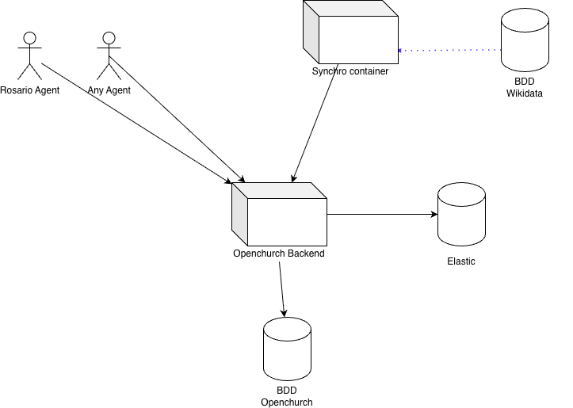

# Whats is OpenChurch ?

Openchurch aims to be an open API in order to allow anyone to find data about dioceses, parishes, and churches. As ecclesia reality is complex, openchurch does not serve fully trustable information. Instead, it serves informations who have been entered by multiple agents.  
Currently, it serves [the Rosario app](https://rosario.app/), allowing people to easily join a parish to pray chapelet.

## API documentation

Documentation is available at `/api/docs`:

- https://api.openchurch.local/api/docs

## How does it work?

There are 2 main services : `backend` and `python`. The `backend` aims to provide an API, and `python` aims to retrieve data from wikidata, and import it to the backend.  
There is also an `elastisearch` service. Data coming from wikidata is indexed in an elastic instance in order to find it using search. For now, only diocese and parish can be searched.

## Development

### Project setup

This project uses Symfony with Api-Platform. Make sure to have docker installed on your machine.

1. Git clone `git@github.com:hozana/openchurch.git`
2. Setup your `/etc/hosts` to include `127.0.0.1 api.openchurch.local`
3. Build the containers: `docker compose build`
4. Run the containers: `docker compose up`
5. You can navigate to https://api.openchurch.local/api/docs to see the doc. You can also go to https://api.openchurch.local/dashboard in order to see the importation of data status.
6. Once data have been imported (or whenever you want) you can run the command `bin/console app:index:communities` from the backend container in order to index all communities to elastic.
7. You are ready to query the API

## Synchro with wikidata

From `python`service, load data from Wikidata: `/opt/venv/bin/python /app/synchro.py --entity-only xxx` where xxx can be either `diocese`, `parish` or `church`.

Whyle the synchro is occuring, data drom wikidata is being fetched by batch of `50000` elements. When some data are being imported, an import status is being reported to the `redis` service. Thanks to it, if the process failed during run, it can start again where it stopped. Moreover, if multiple processes are started at the same time, they will handle different batches.

Data are being requested from wikidata thanks to a sparql query. All logic resides in `sripts/synchro.py`. Importing diocese takes several minutes. Parishes takes about 30 minutes. Churches is longer (around 2 hours).

When processing a batch, the python script calls `[PUT] /places/upsert` endpoint for churches, or `[PUT] /communities/upsert` for communities (ie diocese/parishes). The wikidataId is being stored, so the data can be either updated or inserted.
